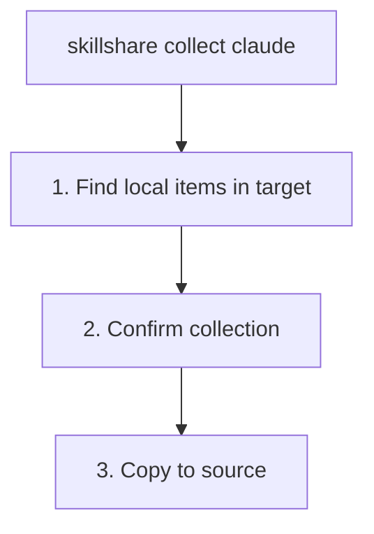

# collect

從 target 收集本機的 skill 或 agent 回 source。

```bash
skillshare collect claude           # From specific target
skillshare collect --all            # From all targets
skillshare collect claude --dry-run # Preview
skillshare collect agents claude    # Collect agents instead of skills
```

## 何時使用

當你直接在 target 目錄中建立或編輯了資源，想把它們拉回 source of truth 時，就使用 `collect`：

1. 加入 source 以便分享
2. 同步到其他 AI CLI
3. 用 git 備份

範例：

- Skills: `~/.claude/skills/my-skill/`
- Agents: `~/.claude/agents/tutor.md`

技能資料夾必須包含 `SKILL.md`；目標中的其他資料夾（例如暫存目錄）不會被 collect。

## 執行流程



:::tip
收集過程會自動排除 `.git/` 目錄。如果你直接把 skill repo git-clone 到 target 目錄中，只有 skill 內容會被複製，repository metadata 不會跟著移動。
:::

:::note
網頁儀表板的 **Collect** 頁面目前只支援 skills。若要 `collect agents`，請使用 CLI。
:::

## 選項

| Flag | Description |
|------|-------------|
| `--all, -a` | Collect from all targets |
| `--force, -f` | Overwrite existing items in source and skip confirmation |
| `--dry-run, -n` | Preview without making changes |
| `--json` | Output JSON and skip confirmation; existing items in source still require `--force` to overwrite |

## JSON 輸出

```bash
skillshare collect claude --json
```

```json
{
  "pulled": ["new-skill", "another-skill"],
  "skipped": [],
  "failed": {},
  "dry_run": false,
  "duration": "0.123s"
}
```

搭配 `--dry-run` 可預覽而不做任何變更：

```bash
skillshare collect claude --json --dry-run
skillshare collect -p --json
skillshare collect -p agents --json
```

## 輸出範例

```bash
$ skillshare collect claude
Local skills in targets
  another-skill  claude · ~/.claude/skills/another-skill
  new-skill      claude · ~/.claude/skills/new-skill
? Collect these skills to source? [y/N] y

✓ another-skill  copied to source
✓ new-skill      copied to source

✓ Collected 2 skills · 0.1s

Next
  skillshare sync    link them into every target
  skillshare commit  save them in git
```

## 處理衝突

如果 source 中已存在同名項目，collection 預設會跳過它：

```bash
$ skillshare collect claude
Local skills in targets
  my-skill  claude · ~/.claude/skills/my-skill
? Collect these skills to source? [y/N] y

! my-skill  already exists in source · use --force to overwrite

! Collected 0 skills, 1 skipped · 0.0s

# To overwrite:
$ skillshare collect claude --force

$ skillshare collect agents claude
Local agents in targets
  tutor.md  claude · ~/.claude/agents/tutor.md
? Collect these agents to source? [y/N] y

! tutor.md  already exists in source · use --force to overwrite

! Collected 0 agents, 1 skipped · 0.0s
```

## 工作流程

在 target 中建立 skill 之後的典型工作流程：

```bash
# 1. Create skill in Claude
# (edit ~/.claude/skills/my-new-skill/SKILL.md)

# 2. Collect to source
skillshare collect claude

# 3. Sync to all other targets
skillshare sync

# 4. Commit to git (optional)
skillshare push -m "Add my-new-skill"
```

對於 agents，使用專屬的 collect/sync 組合：

```bash
skillshare collect agents claude
skillshare sync agents
```

## 另請參閱

- [sync](/docs/reference/commands/sync) — 從 source 同步到 targets
- [diff](/docs/reference/commands/diff) — 查看僅存在於本機的 skills
- [push](/docs/reference/commands/push) — 推送到 git remote
