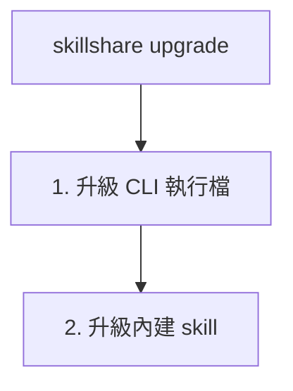

# upgrade

升級 skillshare CLI 執行檔與/或內建的 skillshare skill。

```bash
skillshare upgrade              # 升級 CLI 與 skill
skillshare upgrade --cli        # 僅 CLI
skillshare upgrade --skill      # 僅 skill
```

## 使用時機

- skillshare CLI 有新版本可用
- 內建的 skillshare skill 需要更新
- `doctor` 回報有可用更新之後

```text
skillshare upgrade --skill --dry-run

! Dry run mode - no changes will be made

▸  Skill  skillshare
│
├─ Current  v0.21.12
│
├─ Checking latest version...
├─ Latest: v0.21.13 (1.0s)
│
└─ Action  Would upgrade to v0.21.13
```

## 執行內容



## 選項

| Flag | 說明 |
|------|-------------|
| `--cli` | 僅升級 CLI |
| `--skill` | 僅升級 skill（若尚未安裝則會提示） |
| `--force, -f` | 略過確認提示 |
| `--dry-run, -n` | 預覽而不做任何變更 |
| `--help, -h` | 顯示說明 |

## Homebrew 使用者

若你是透過 Homebrew 安裝的，`skillshare upgrade` 會自動委派給 `brew upgrade`：

```bash
skillshare upgrade
# → brew update && brew upgrade skillshare
```

你也可以直接使用 Homebrew：

```bash
brew upgrade skillshare
```

## 範例

```bash
# 標準升級（CLI 與 skill 皆升級）
skillshare upgrade

# 預覽會升級的內容
skillshare upgrade --dry-run

# 強制升級，不提示
skillshare upgrade --force

# 僅升級 CLI 執行檔
skillshare upgrade --cli

# 僅升級 skillshare skill
skillshare upgrade --skill
```

## 升級後

若你升級了 skill，執行 `skillshare sync` 以分發它：

```bash
skillshare upgrade --skill
skillshare sync  # 分發到所有 targets
```

## 升級的內容

### CLI 執行檔

`skillshare` 執行檔本身。從 GitHub releases 下載。

取代你正在執行的二進位檔之前，會先依 release 的 `checksums.txt` 驗證下載的壓縮檔，所以損毀或比對不一致的下載只會中止升級，不會把自己安裝上去。現行二進位檔維持原樣，錯誤訊息會指出不一致的地方。

在終端機中，下載時會顯示已下載的大小，因此連線較慢時不會看起來像是卡住。下方的 Web UI 資源也會顯示相同的進度。

```
Downloading v0.21.4...  3.2 MB / 9.1 MB
```

安裝腳本現在預設使用 `~/.local/bin`，正常更新不需要 `sudo`。既有安裝仍保留原本的位置。

若執行檔位於受保護的目錄（例如 `/usr/local/bin`），skillshare 只會用 `sudo` 替換執行檔 — 不需要手動加上前綴。內建 skill、UI 資源與紀錄仍以你的身分寫入，所以不要用 `sudo` 執行整個升級：這會在 skill 來源目錄留下 root 擁有的檔案，之後 `git pull` 會出現 `Permission denied`。

如果先前的升級已經留下這類檔案，更新內建 skill 會以 `permission denied` 失敗，錯誤訊息會附上把 skill 來源目錄還給你的指令，例如：

```bash
sudo chown -R "$(id -un)" ~/.config/skillshare/skills
```

沒有終端機可以輸入密碼時（Dashboard 的 **立即更新** 按鈕、CI），升級會立刻停止，並提示你改在終端機執行 `skillshare upgrade`，不會一直等待輸入。已快取的 `sudo` 憑證與 `NOPASSWD` 設定仍會直接升級，不會出現提示。

### Web UI 資源

升級後，skillshare 會預先下載新版本的 Web UI 前端資源。這些會快取於 `~/.cache/skillshare/ui/<version>/`，並在你執行 `skillshare ui` 時提供服務。

若預先下載失敗（例如網路問題），這些資源會在下一次啟動 `skillshare ui` 時下載。

### skillshare Skill

內建的 `skillshare` skill 會在 AI CLIs 中加入 `/skillshare` 指令。位置在：
```
~/.config/skillshare/skills/skillshare/SKILL.md
```

## 另請參閱

- [update](/docs/reference/commands/update) — 更新其他 skills 與儲存庫
- [status](/docs/reference/commands/status) — 檢查目前版本
- [doctor](/docs/reference/commands/doctor) — 診斷問題
